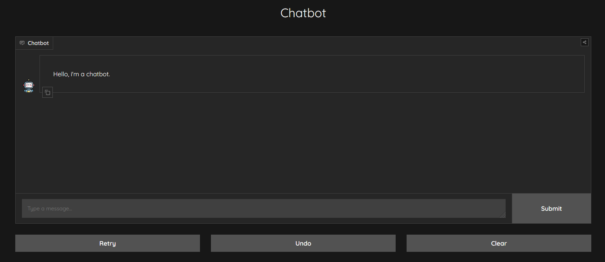

# Chatbot_Template

This is a template for a chatbot that can be used to create a chatbot for any purpose. It is written in Python and 
uses the [Gradio](https://gradio.app/) library to create a web interface for the chatbot and 
[TextBlob](https://textblob.readthedocs.io/en/dev/) for tokenization.




## Installation

To install the required libraries, run the following command in the terminal:

```bash
pip install -r requirements.txt
```

## Usage

To run the chatbot, run the following command in the terminal:

```bash
python main.py
```

## Customization

To customize the chatbot, you can modify the following files:
- icons/: This folder contains the icons for the chatbot. You can change the icons to whatever you want. The icon for the human is named "human.png," and the icon for the chatbot is named "robot.png."
- main.py: This file contains the code for the chatbot. You can modify the code to customize the chatbot.
- requirements.txt: This file contains the required libraries for the chatbot. You can add or remove libraries to customize the chatbot.
- style.css: This file contains the CSS for the chatbot. You can modify the CSS to customize the chatbot.
- ia.py: This file contains the code for the chatbot. You can modify the code to customize the chatbot.
- data.json: This file contains the data for the chatbot. You can change the data to customize the chatbot.

## Contributing
Pull requests are welcome. For major changes, please open an issue first to discuss what you would like to change.

## References
- [Gradio](https://gradio.app/)
- [TextBlob](https://textblob.readthedocs.io/en/dev/)